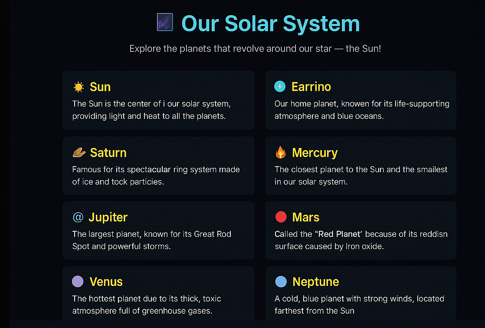

# 🌌 Solar System Explorer

An interactive and visually appealing website that showcases the planets of our Solar System.  
Built using **HTML5 + CSS3**, this project provides a simple, modern design for learning and exploring space.

---

## 🚀 Features

- Clean and modern UI with space-inspired theme  
- Information cards for each planet 🌍🪐☀️  
- Hover effects for better interactivity  
- Fully responsive design  

---

## 📸 Preview

> Add a screenshot or banner of your site here!  
For example:
```markdown

